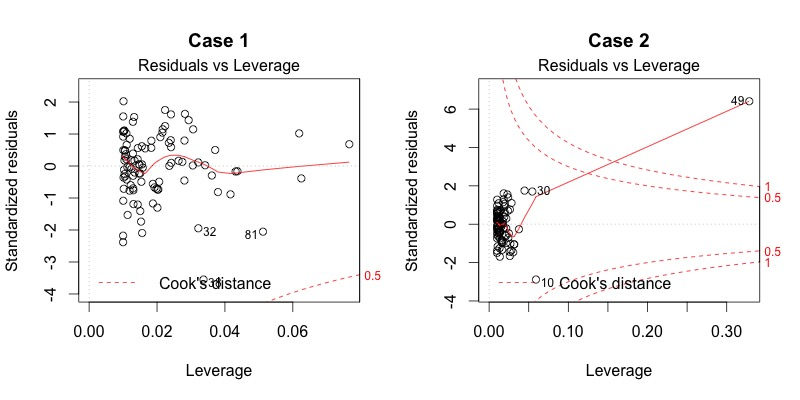

layout: true

## Load required libraries

---
`tidyverse` loads in packages around Hadley Wickham's principles of tidy data.

```{r echo=TRUE, results='hide'}
library(tidyverse)
```
---
Some other libraries required for processing dates and doing Generalized Additive 
Models.

```{r}
library(lubridate)
library(gam)
```

```{r message=FALSE, warning=FALSE, include=FALSE, paged.print=FALSE, results='hide'}
library(knitr)
theme_set(theme_light())
knitr::opts_chunk$set(echo = T, messages=F, warning=F, error = F, cache=T)
```
---
layout: false
## Load Data

This is a sample set of transaction data in a 10 minute timeseries.

```{r}
data <- readRDS("data/rpmui.RDS")
```
--
```{r}
summary(data$throughput)
```
--
```{r}
summary(data$timestamp)
```
--
```{r}
summary(data$start_time)
```

---
layout: false
## Preview Data 

What does throughput look like as a function of time of day and day of week?
--
```{r}
ggplot(data) + aes(start_time, throughput) + 
    geom_point(alpha=0.6, size=0.5) +
    scale_x_datetime(date_labels='%H:%m')
```
---
Preview Days of Week
```{r}
ggplot(data) + aes(x=timestamp, y=throughput) +
    geom_point(size=0.2) +
    scale_x_datetime(date_labels='%H:%m')
```
---
Color the Days
```{r}
(g <- ggplot(data) + aes(x=start_time, y=throughput) +
    geom_point(aes(color=day), alpha=0.6, size=0.5) +
    scale_x_datetime(date_labels='%H:%m'))
```
---
### Predict throughput from time of day

```{r}
model.linear <- lm(throughput ~ minute_of_day, data=data)
model.linear
```
---

Predict the throughput at 3:00 pm.

```{r}
minute_of_day.3pm <- 15 * 60
beta <- coef(model.linear)
beta[1] + minute_of_day.3pm * beta[2]
```
---
What does this look like?  

First create a dataset of uniform values across predictors.

```{r}
minute_of_day <- seq(0, 24 * 60 - 1, 10)
predictions <- data.frame(minute_of_day,
                          start_time = min(data$start_time) + dminutes(minute_of_day))
head(predictions)
```

Now use the model to populate the predicted values for throughput.

```{r}
predictions$throughput <- predict(model.linear, newdata=predictions)
head(predictions, 10) 
```

That's our baseline!  What does it look like?


```{r}
g + geom_line(aes(x=start_time, y=throughput), color='red', size=1, data=predictions) 
```

Show some details on the model.

```{r}
summary(model.linear)
```
### Polynomial Regression

First, let's leave off weekend data.

```{r}
data.midweek <- filter(data,  ! (day %in% c('Sat', 'Sun') ))
```

Now recalculate the linear model and predictions without the weekend data.

```{r}
model.midweek.linear =  lm(throughput ~ minute_of_day, data=data.midweek)
predictions$throughput <- predict(model.midweek.linear, newdata=predictions)
```

```{r}
g.midweek <- ggplot(data.midweek) +
    geom_point(aes(x=start_time, y=throughput, color=day), alpha=0.6, size=0.5) +
    scale_x_datetime(date_labels='%H:%m')
g.midweek + geom_line(aes(x=start_time, y=throughput), color='red', size=1, data=predictions) 
```

Use quadratic predictors on the minute of the day.

```{r}
model.midweek.quadratic <- lm(throughput ~ I(minute_of_day**2) + minute_of_day, data=data.midweek)
summary(model.midweek.quadratic)
```

Regenerate throughput prediction using the quadratic model.

```{r}
predictions$throughput <- predict(model.midweek.quadratic, newdata=predictions)
```

What does it look like now?

```{r}
g.midweek + geom_line(aes(x=start_time, y=throughput), data=predictions, color='red', size=1) 
```

Use higher degree polynomial via `poly()` function in the formula.

```{r}
model.midweek.poly <- lm(throughput ~ poly(minute_of_day, 20), data=data.midweek)
summary(model.midweek.poly)
```

```{r}
predictions$throughput <- predict(model.midweek.poly, newdata=predictions)

g.midweek + geom_line(aes(x=start_time, y=throughput), data=predictions, color='red', size=1) 
```


# Multiple Regression

Use two new terms instead of minute of day.

```{r}
data$minute_of_day.cos <- cos(data$minute_of_day*2*pi/1440)
data$minute_of_day.sin <- sin(data$minute_of_day*2*pi/1440)
data.midweek <- filter(data, ! day %in% c('Sat', 'Sun') )
model.midweek.radial <- lm(throughput ~ minute_of_day.cos + minute_of_day.sin, data=data.midweek)
summary(model.midweek.radial)
```

To assess the model update our predictions with the new features, then recalculate the
predicted throughput.

```{r}
predictions <- mutate(predictions,
                      minute_of_day.cos = cos(minute_of_day*2*pi/1400),
                      minute_of_day.sin = sin(minute_of_day*2*pi/1400))
predictions$throughput <- predict(model.midweek.radial, newdata=predictions)
head(predictions)
```

How does this look?

```{r}
g.midweek + geom_line(aes(x=start_time, y=throughput), data=predictions, color='red', size=1) 
```


# Combined Terms

Best of both worlds?  Let's do a cubic on the sin and cos terms.

```{r}
model.midweek.combined <- lm(throughput ~ poly(minute_of_day.cos, 3) + poly(minute_of_day.sin, 3), data=data.midweek)
summary(model.midweek.combined)
```

Bonus question: why is the term $sin^2$ not significant?


```{r}
predictions$throughput <- predict(model.midweek.combined, newdata=predictions)

g.midweek + geom_line(aes(x=start_time, y=throughput), data=predictions, color='red', size=1) 
```

### Summary of Model Performance

```{r}
modelnames <- c("model.linear", "model.midweek.combined", "model.midweek.linear", "model.midweek.poly","model.midweek.quadratic", "model.midweek.radial")
models        <- mget(modelnames) %>% lapply(summary)
formulas      <- sapply(models, getElement, 'call')
adj.r.squared <- sapply(models, getElement, 'adj.r.squared')
f.statistic   <- lapply(models, getElement, 'fstatistic') %>% sapply(getElement, 1)
data.frame(Model=modelnames,
           'R_Squared'=round(adj.r.squared, 2),
           'F_Statistic'=round(f.statistic)) %>%
    arrange(desc(R_Squared)) %>%
    kable(row.names=F)
```

# Diagnostic Plots

The R `lm()` function includes diagnostic plots analyzing the residuals to assess the quality of the model.

You can use `plot(model)` to view the plots interactively one at a time.

#### Residual vs Fitted


#### Normal Q-Q


#### Scale-Location

Verify the assumption of equal variance of the target variable across its predictors: homoscedasticity.


#### Residuals vs Leverage



#### Throughput Model Diagnostics

```{r}
plot(model.midweek.linear)
```

```{r}
plot(model.midweek.quadratic)
```

```{r}
plot(model.midweek.poly)
```

# Categorical Predictors

Revisit the throughput dataset.

Include the days of the week.

```{r}
data <- readRDS("data/rpmui.RDS") 
data$minute_of_day.cos <- cos(data$minute_of_day*2*pi/1440)
data$minute_of_day.sin <- sin(data$minute_of_day*2*pi/1440)

model.byday <- lm(throughput ~ poly(minute_of_day,8) + day, data=data)
summary(model.byday)
```


```{r}
contrasts(data$day)
```


Look at the model without an intercept.

```{r}
model.z <- lm(throughput ~ poly(minute_of_day, 8) + day + 0, data=data)
summary(model.z)
```

What does this look like?

First, create sample data in multiple dimensions:

```{r}
predictions.byday <- expand.grid(start_time=predictions$start_time, 
                                 day=factor(c('Mon', 'Tue', 'Wed', 'Thu', 'Fri', 'Sat', 'Sun'))) %>%
    right_join(predictions, by='start_time')
head(predictions.byday)
```

Now Create the predictions using all the dimensions:
```{r}
predictions.byday$throughput <- predict(model.byday, newdata = predictions.byday)
```

Show the plots:

```{r}
ggplot(predictions.byday) + aes(x=start_time, y=throughput, color=day) + geom_line(linetype=2, size=0.5)
```

```{r}
g + aes(color=day) +
   geom_line(aes(x=start_time, y=throughput, color=day), linetype=2, inherit.aes = F, size = 0.5, data = predictions.byday) 
```


# Smoothing Splines

Build a spline interpolation.

```{r}
model.spline <- smooth.spline(data$minute_of_day, data$throughput)
predictions$throughput <- model.spline$y
```

Display the result:

```{r}
g + geom_line(aes(x=start_time, y=throughput), data=predictions, color='red', size=1) 
```

# Generalized Additive Models

Can we combine splines with multiple regression?


```{r}
model.gam <- gam(throughput ~ s(minute_of_day, spar=0.5) + day, 
                 data = data)

predictions.byday$throughput <- predict(model.gam, newdata=predictions.byday)

g + geom_line(aes(x=start_time, y=throughput, color=day), data=predictions.byday, size=1) 

```


Add a weekend flag:

```{r}
data$weekend <- data$day %in% c('Sat', 'Sun')
predictions.byday$weekend <- predictions.byday$day %in% c('Sat', 'Sun')
head(predictions.byday, 7)
```


```{r}
model.fullsplines <- gam(throughput ~ weekend * s(I(minute_of_day + (weekend * 1440)), spar=0.2), 
                         data = data)

predictions.byday$throughput.fullsplines <- predict(model.fullsplines, newdata=predictions.byday)

g + geom_line(aes(x=start_time, y=throughput.fullsplines, linetype=weekend), data=predictions.byday, size=1) 
ggplot(predictions.byday) + aes(x=start_time, y=throughput.fullsplines, color=weekend) + geom_line()
```

# Logistic Regression

Look at the Titanic dataset.

```{r}

passengers <- read.csv('data/titanic_training.csv')
summary(passengers)
```

Encode the survival as a boolean, and fill in missing ages with the average.

```{r}
passengers$Survived <- as.logical(passengers$Survived)
passengers$Age[is.na(passengers$Age)] <- median(passengers$Age, na.rm=T)
```

Create training and test sets.

```{r}
set.seed(1001)
i <- caret::createDataPartition(passengers$Survived, p=0.80,list=F)
passengers.training <- passengers[i,]
passengers.test <- passengers[-i, ]
nrow(passengers.test)
```

Let's predict whether a passenger survived based on their class, sex and age.

```{r}
model.lm <- lm(Survived ~ Pclass + Sex,
            data=passengers.training)
summary(model.lm)
```

```{r}
predictions.lm <- predict(model.lm, newdata=passengers.test)
summary(predictions.lm)
```

Show the confusion matrix.

```{r}
caret::confusionMatrix(predictions.lm > 0.51, passengers.test$Survived)
```

Try another model using logistic regression.


```{r}
model.glm <- glm(Survived ~ Pclass + Sex + Age, 
                 data=passengers.training,
                 family=binomial(link='logit'))
summary(model.glm)
```

```{r}
predictions.glm <- predict(model.glm, type='response', newdata=passengers.test)
summary(predictions.glm)
```

```{r}
caret::confusionMatrix(predictions.glm > 0.53, passengers.test$Survived)
```


# Example: Impact of Load on Performance

```{r}
transactions <- readRDS('data/sample_server_app.RDS')
names(transactions)
```


```{r}
g <- ggplot(transactions) +
    aes(x=cpm, y=duration) +
        geom_point(aes(color=start_bucket), size=1, alpha=0.5) +
        scale_color_gradientn(name='Minute of Day', colors=c('#006666', '#FF0000', '#006666'))+
        ggtitle("Throughput vs Response Time") +
    ylim(0, NA)
g
```

Can we predict duration from the load?

```{r}
g + stat_smooth(method='lm', color='black')
```


```{r}
model.linear.simple <- lm(duration ~ cpm, data=transactions)
summary(model.linear.simple)
```

Do the pages have an effect?

```{r}
cpm_columns <- names(transactions) %>% startsWith('cpm.')

# Fill NA's with zeros
index.na <- is.na(transactions)
for (col in which(cpm_columns)) { transactions[index.na[,col],col] <- 0 }

# Create rate columns with proportion of traffic to each name
transactions[,paste0('rate.', names(transactions)[cpm_columns])] <- transactions[,cpm_columns] / transactions$cpm
```

The rate fields now have the percentage of traffic that hit that page, rather than the raw calls per minute:
```{r}
summary(transactions$`rate.cpm.name.Controller/api/v1/telematics/update_asset`)
```

Now perform a regression using the page rates as predictors.

Do a regression on all rate columns:

```{r}
model <- lm(duration ~ ., data = select(transactions, duration, cpm, starts_with('rate.cpm')))
summary(model)
```

Use that model to pick out the predictors that have a p value less than 0.05.

```{r}
all.coef <- anova(model)
significant_factors <- rownames(all.coef)[all.coef[[5]] < 0.05] %>% 
    sub(pattern="`(.*)`", replacement="\\1") %>%
    head(-1)
significant_factors
```

Create a new dataset with only the singificant factors.

```{r}
data <- transactions[,c('duration', significant_factors)]
```

Now perform three different regressions on that data predicting the duration.

```{r}
model.linear <- lm(duration ~ ., data = data)
model.quadratic <- lm(duration ~ I(cpm^2) + ., data = data) #%>% step(direction='backward', trace=F)
model.spline <- gam(duration ~ s(cpm, spar=0.9) + ., data = data)
```

Now what would the duration look like if we eliminated all page effects?

Create a dummy dataset that ignores the effects of pages by setting the rates to zero.

```{r, fig.height=8, fig.width=10}
predictions <- data[1,]
predictions[1:200,] <- 0
predictions$cpm <- seq(min(data$cpm), max(data$cpm), length.out = 200)

predictions$duration.linear <- predict(model.linear, newdata=predictions)
predictions$duration.quadratic <- predict(model.quadratic, newdata=predictions)
predictions$duration.spline <- predict(model.spline, newdata=predictions)
#df <- melt(predictions, c('cpm'), 
#            c('duration.linear', 'duration.spline', 'duration.quadratic'), variable.name = 'model', #value.name = 'duration')

df <-select(predictions, -duration) %>%
    gather('model', 'duration', duration.linear, duration.spline, duration.quadratic)

ggplot(transactions) +
    aes(x=cpm, y=duration) +
    geom_point(color='black', alpha=0.2, size=0.2) +
    stat_smooth(method='loess', color='black') +
    geom_line(aes(x=cpm, y=duration, color=model, linetype=model), data=df) +
    ggtitle(paste0('Prediction based on load'),
            subtitle='with overlay of unfiltered sample data') +
    ylim(0.5, 2.5)
```

Compare the simple model to the page effects model:

```{r}
bind_rows(as.list(coef(model.linear)[1:2]),
          as.list(coef(model.linear.simple)))

```
